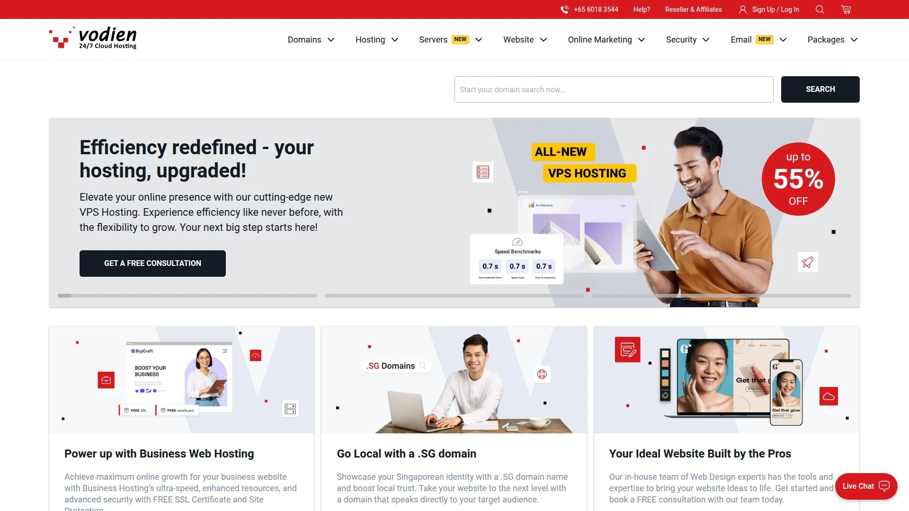
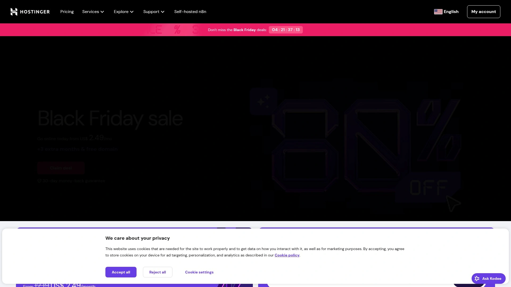
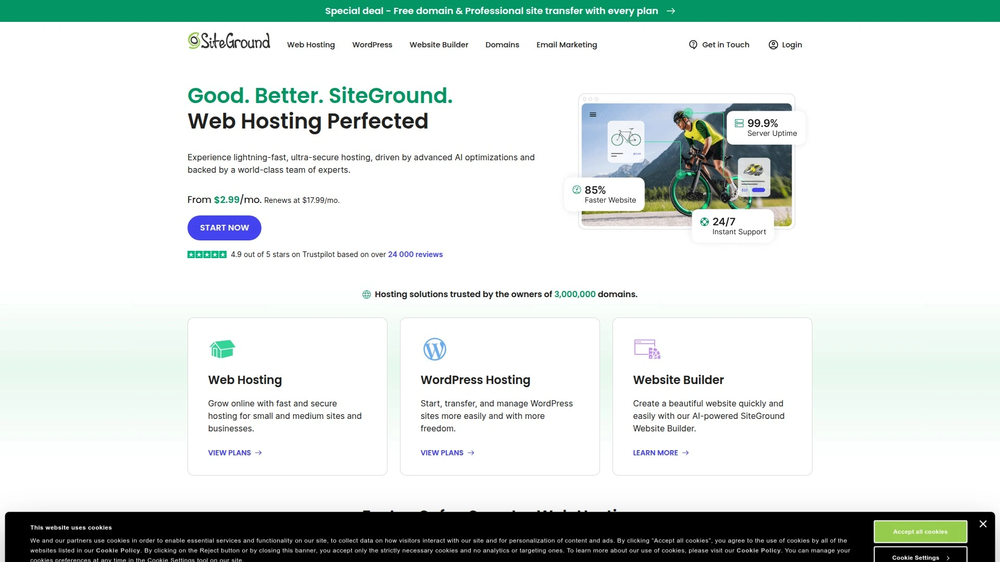
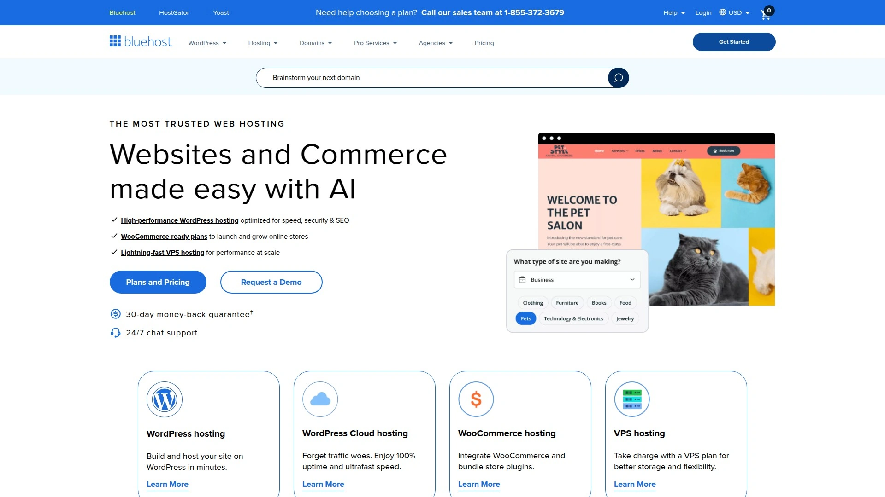
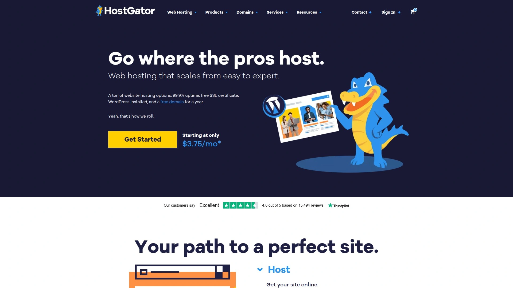
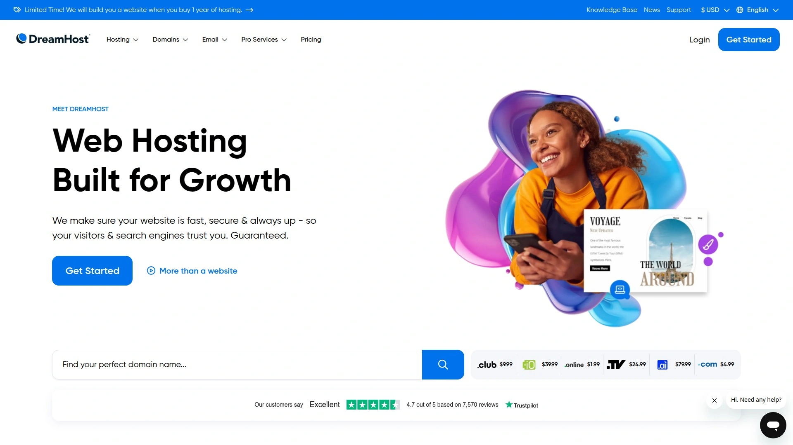
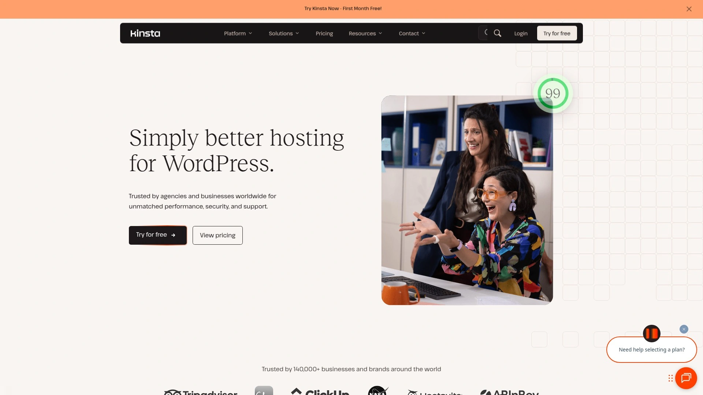
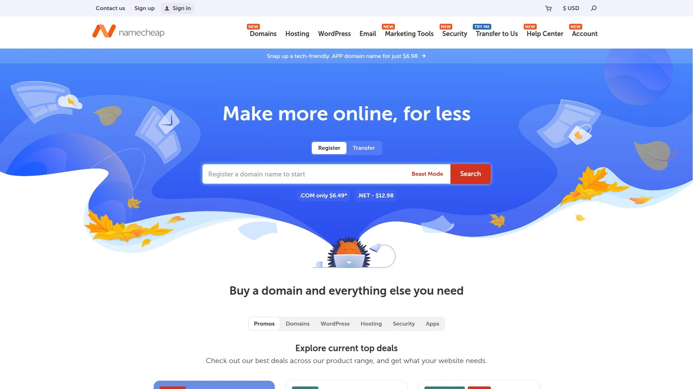
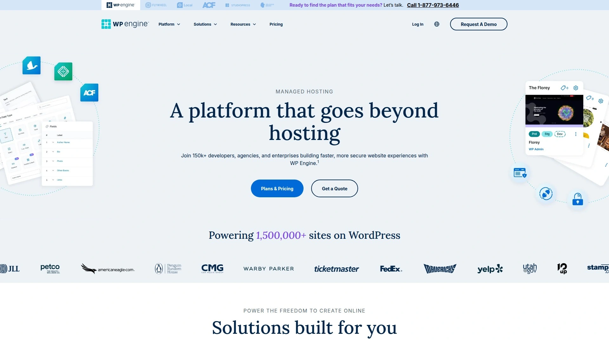
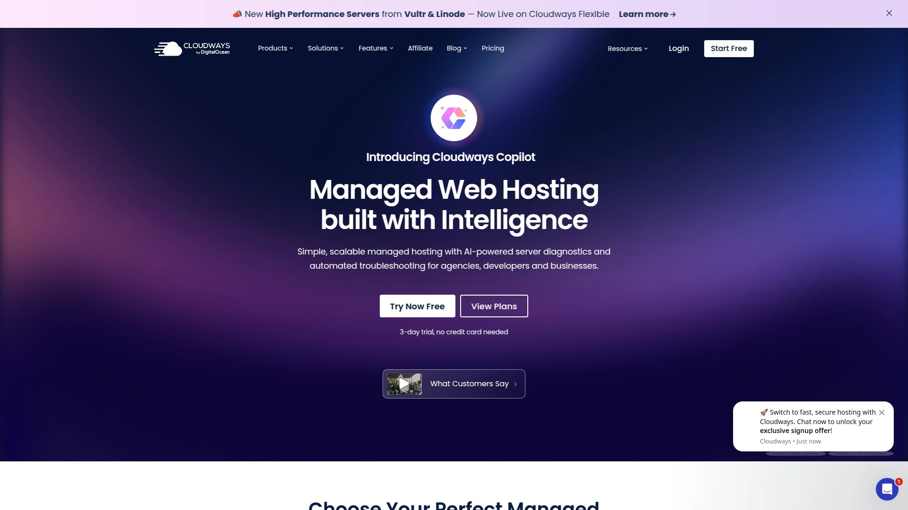

# 11 Best Global Web Hosting Platforms (Comprehensive Review)

Running a website without reliable hosting means dealing with frequent downtime, sluggish page loads that drive visitors away, and security vulnerabilities that expose customer data. Quality web hosting providers deliver fast server response times, automatic backups, one-click WordPress installations, and 24/7 technical support that keeps your site running smoothly even during traffic spikes. This guide examines eleven hosting platforms spanning shared hosting for beginners, managed WordPress solutions for content creators, and scalable VPS options for growing businesses—breaking down pricing structures, performance benchmarks, and feature sets that actually matter when your online presence depends on uptime.

***

## **[Vodien](https://www.vodien.com)**

Singapore-based hosting company with local servers delivering exceptional speeds across Asia-Pacific, supporting 210,000+ users with comprehensive business-focused plans and 24/7 phone support.

Founded in 2002, Vodien operates as Singapore's homegrown web hosting specialist serving medium to large businesses requiring feature-rich solutions. The company maintains physical servers in Singapore, eliminating long-distance latency issues for websites targeting the Asia-Pacific region. This geographic advantage translates to faster load times for visitors across Southeast Asia, Australia, and neighboring markets.

Their hosting infrastructure supports over 210,000 users and 35,000 companies worldwide, with client bases concentrated in Asia-Pacific but extending internationally. Vodien's entry-level webValue plan includes 5GB disk space, ten email accounts, support for five hosted websites, unlimited data transfer, and 99.9% network and hardware SLA guarantees. Even their smallest WordPress hosting plan handles 100,000 monthly visits—substantially more capacity than most beginning webmasters require.

The platform provides one-click installers for 400+ applications including WordPress, Joomla, Magento, and MediaWiki, simplifying initial setup for non-technical users. Visual web hosting control panels feature simple file managers, email account management tools, and streamlined application installers. Vodien's proprietary security tools include spamGuard for email protection and webGuard offering SQL injection defense, advanced log analysis, and Google browser security compliance.

Shared hosting plans scale from 15GB to 150GB storage, accommodating 5 to 45 websites with 10 to 90 email accounts and matching database allocations. All tiers include unlimited bandwidth, cPanel access, unlimited FTP accounts, unlimited subdomains, optional SSL certificates, 24/7 customer support, backups, and site analytics. VPS hosting options span Linux VPS (starting $11.50 monthly), managed VPS (from $152 monthly with server hardening and dedicated administration), and Windows VPS configurations.

WordPress-specific packages deliver website transfers, automatic core updates, one-click staging environments, and GIT pre-installation. Business hosting tiers ($17.83 to $149.50 monthly) bundle SSL certificates, dedicated IPs, spamGuard email protection, antivirus scanning, and A.I. Sentry monitoring. The company's Cloud Assurance backup system protects email hosting with encryption and malware defense.

***

## **[Hostinger](https://www.hostinger.com)**

Budget-friendly hosting giant with LiteSpeed servers delivering 0.8-second load times, 100% uptime reliability in testing, and plans starting under $3 monthly for unlimited bandwidth.

Hostinger dominates the affordable hosting space while maintaining premium performance standards. Independent testing reveals 0.8-second GTmetrix fully loaded times paired with perfect 100% uptime during monitoring periods. This combination of speed and reliability exceeds what many pricier competitors deliver.

The platform operates 12 data centers globally—3 in the US, 5 across Europe, 3 in Asia, and 1 in South America—ensuring visitors worldwide experience fast connections. LiteSpeed web servers power the infrastructure, optimizing WordPress sites and static content delivery. Plans include 100GB SSD storage with generous resource allocations that support growing websites.

Hostinger's custom hPanel replaces traditional cPanel with a simplified dashboard designed for beginners. One-click WordPress installation, automatic updates, and built-in caching make launching sites effortless. The platform handles small personal blogs and medium business sites equally well, with pricing that remains accessible during renewal periods.

Security measures include free SSL certificates, basic malware scanning, and DDoS protection. Customer support operates 24/7 through live chat, though phone support isn't available. The main limitation? Advanced developers seeking granular server configuration controls may find the managed environment restrictive.

Promotional pricing frequently drops below $3 monthly for multi-year commitments, making Hostinger the most economical choice for users prioritizing value without sacrificing essential features. Free domain privacy protection accompanies most plans, an uncommon inclusion at this price point.

***

## **[SiteGround](https://www.siteground.com)**

Developer-focused hosting with Google Cloud infrastructure, 30% faster PHP processing, built-in SEO tools, and free daily backups across all WordPress-optimized plans.

SiteGround targets developers and advanced users requiring sophisticated tools paired with managed convenience. The platform runs on Google Cloud infrastructure providing enterprise-grade reliability. NGINX web servers deliver 1.1-second average load times with 100% uptime during independent testing.

Their WordPress optimization includes 30% faster PHP processing compared to standard configurations, accelerating dynamic content generation. Built-in SEO tools help sites rank better without requiring separate plugins. Staging environments let developers test changes safely before deploying to live sites.

SiteGround operates 16 data centers—4 in the US, 5 throughout Europe, 1 in Asia, and 1 in Australia—offering geographic flexibility for latency optimization. Plans provide 10GB to 40GB SSD storage with features including free SSL certificates, free website transfers, and email hosting. Daily automated backups protect against data loss without manual intervention.

Customer support earns consistent praise for technical expertise and responsiveness across phone, live chat, and ticketing systems. Representatives handle complex troubleshooting rather than just reading scripts. The company demonstrates environmental responsibility by sourcing renewable energy for data center operations.

Pricing sits higher than budget competitors, with renewal rates reaching $17.99 monthly for entry-level plans. Server response times lag behind leaders like IONOS in comparative testing. However, the combination of developer tools, premium support, and WordPress-specific optimizations justifies costs for users prioritizing these features.

***

## **[Bluehost](https://www.bluehost.com)**

WordPress-recommended hosting with official endorsement, one-click installation, optimized performance configurations, and dedicated WordPress-trained support teams available 24/7.

Bluehost holds official WordPress.org recommendation status—one of only three providers with this endorsement. This partnership ensures seamless WordPress integration with one-click installation, automatic updates, and performance optimization tuned specifically for WordPress sites. WordPress-certified support teams understand platform-specific issues better than generic hosting support.

Plans start at $1.99 monthly for promotional periods, covering 10GB to unlimited SSD storage depending on tier. All packages include free domain names for the first year, free SSL certificates, unlimited bandwidth, and email hosting. The Bluehost interface simplifies website management through AI-powered builders that accelerate site creation.

WooCommerce hosting solutions integrate virtual point-of-sale systems, payment processing, and eCommerce-specific security measures. Business plans support unlimited websites with unmetered bandwidth, ideal for agencies managing multiple client sites. VPS and dedicated server options provide scalability for enterprises outgrowing shared hosting.

Security features include SiteLock protection, DDoS defense, and free daily backups on higher-tier plans. Customer support operates 24/7 through live chat and phone, with representatives specifically trained in WordPress troubleshooting. Renewal pricing increases significantly after promotional periods, reaching $11.99 monthly for basic plans.

Performance testing reveals Bluehost's Apache servers deliver solid speeds for most use cases, though not the absolute fastest among competitors. The platform particularly suits beginners launching their first WordPress site or small businesses needing reliable hosting with extensive support resources.

***

## **[IONOS](https://www.ionos.com)**

Enterprise-grade provider achieving fastest site speeds and perfect uptime in testing, offering $1 monthly introductory pricing with daily backups and carbon-neutral operations.

IONOS outperforms every tested competitor in speed and uptime metrics. Apache web servers consistently deliver 0.78-second fully loaded times—the fastest result among 10 major providers. Perfect 100% uptime during monitoring periods demonstrates exceptional reliability.

Infrastructure spans 9 data centers (3 in the US, 6 across Europe) providing strong coverage for transatlantic audiences. Daily automated backups protect data without manual configuration. The company operates as a certified carbon-neutral provider committed to environmental sustainability.

Introductory offers make IONOS the cheapest entry point into quality hosting, with Plus plans starting at just $1 monthly for the first six months. Long-term commitments of 36 months unlock first-year-free promotions, though renewal rates increase considerably afterward. Plans include 25GB to 100GB storage, free SSL certificates, and free domain registration for the first year.

The platform supports both Linux and Windows hosting, though Windows users face steeper pricing. Dedicated hosting plans provide enterprise-level resources for high-traffic sites requiring isolated servers. One notable weakness: customer support quality lags behind competitors, with slower response times and less helpful resolutions.

IONOS suits budget-conscious users willing to accept mediocre support in exchange for exceptional performance and reliability. The combination of industry-leading speeds, perfect uptime, environmental responsibility, and aggressive introductory pricing creates compelling value.

***

## **[HostGator](https://www.hostgator.com)**

Feature-packed provider offering unlimited emails, advanced website builders with eCommerce capabilities, free dedicated IP addresses on premium plans, and $200 advertising credits.

HostGator distinguishes itself through unusually generous feature allocations across all hosting tiers. Unlimited email accounts come standard with every plan, unlike competitors restricting email on entry-level packages. The included website builder surpasses basic tools by supporting full eCommerce storefronts with payment processing and inventory management.

High-end shared hosting plans bundle free dedicated IP addresses and SEO optimization tools—premium features competitors typically charge extra for. Every HostGator package includes $200 in advertising credits for Google Ads and Microsoft Advertising, helping new sites attract initial traffic. Free website migrations transfer existing sites from other hosts without downtime.

Pricing starts at $2.29 monthly for promotional periods covering 10GB SSD storage, free SSL certificates, and unmetered bandwidth. Plans scale up to unlimited storage, databases, and domain hosting. The platform supports shared, VPS, and dedicated server configurations for sites of all sizes.

HostGator uses traditional HDD storage rather than faster SSD drives, impacting performance compared to competitors offering solid-state storage. Response times of 1.7+ seconds fall short of speed leaders. However, comprehensive feature sets and aggressive pricing compensate for moderate performance.

Customer support operates 24/7 through phone, live chat, and ticketing with generally helpful responses. 30-day money-back guarantees provide risk-free testing periods. HostGator works best for beginners wanting extensive features and hand-holding support rather than maximum speed.

***

## **[DreamHost](https://www.dreamhost.com)**

SSD-powered hosting with free domain registration, automatic daily backups, and 97-day money-back guarantee—the industry's longest refund window for risk-free testing.

DreamHost stands out by offering SSD storage across all plans, delivering up to 2x faster performance than traditional HDD drives. This hardware advantage accelerates database queries and file access. Free domain registration for the first year provides immediate cost savings, though renewal rates reach $15 annually.

Automatic daily backups protect sites without requiring manual scheduling or third-party plugins. The 97-day money-back guarantee exceeds industry standards by more than triple, giving users over three months to evaluate service risk-free. This confidence reflects DreamHost's quality and customer retention focus.

Plans support shared, VPS, dedicated, and cloud hosting architectures. WordPress-optimized packages include pre-installed caching, automatic updates, and staging environments for testing. DreamHost's proprietary control panel replaces cPanel with custom interfaces designed for simplicity.

Email hosting requires purchasing the most expensive shared hosting tier or adding paid email separately—an inconvenient limitation compared to competitors bundling email with all plans. The platform lacks advanced website builders, requiring users to build sites manually or through WordPress. DreamHost doesn't include free ad credits like HostGator.

Performance testing shows solid speeds and reliability suitable for most use cases. Customer support operates through ticketing and live chat with knowledgeable staff, though some users prefer phone support availability. DreamHost appeals to technically comfortable users wanting SSD performance and minimal hand-holding.

***

## **[InMotion Hosting](https://www.inmotionhosting.com)**

High-performance hosting with Apache servers, 90-day money-back guarantee, free website migrations, and launch plans starting $2.29 monthly with 100GB SSD storage.

InMotion Hosting delivers enterprise-quality infrastructure at affordable prices. Plans begin at $2.29 monthly, including 100GB SSD storage, free SSL certificates, 10 email addresses, and support for 2 websites. This entry-level package provides more resources than many competitors' basic offerings.

The Pro plan ($10.99 monthly during promotional periods) unlocks unlimited websites, storage, bandwidth, and email addresses. Free domain registration, dedicated IP addresses, and priority customer support accompany premium tiers. Three-year commitments optimize cost-effectiveness at $179.64 for the entire period.

InMotion operates Apache web servers achieving 1.2-second average load times with perfect 100% uptime in testing. Infrastructure includes 3 data centers (2 in the US, 1 in Europe) providing solid coverage for North American and European audiences. The 99.99% uptime guarantee specifically covers Launch, Power, and Pro plans.

Security includes free SSL certificates, automatic malware scanning, DDoS protection, and hack protection. Free website migrations transfer existing sites from other providers with zero downtime. cPanel control panels offer familiar interfaces for experienced users, while custom management tools simplify common tasks.

The 90-day money-back guarantee provides three full months for risk-free evaluation—among the longest in the industry. Customer support operates 24/7 through phone, live chat, and ticketing with US-based teams. InMotion suits users wanting reliable performance, generous resources, and extended testing periods without premium pricing.

***

## **[Kinsta](https://kinsta.com)**

Premium managed WordPress hosting on Google Cloud Platform with 37 global data centers, 0.82-second load times, enterprise security, and plans starting $35 monthly.

Kinsta focuses exclusively on managed WordPress hosting, eliminating shared hosting distractions to optimize specifically for WordPress performance. Google Cloud Platform infrastructure powers the entire network, leveraging Google's global presence and reliability. This enterprise-grade foundation delivers 0.82-second average fully loaded times—among the fastest WordPress hosting available.

The network spans 37 data centers globally plus 260+ CDN points of presence, ensuring visitors worldwide experience minimal latency. NGINX servers handle traffic efficiently with automatic scaling during traffic spikes. Perfect 100% uptime during testing demonstrates exceptional reliability.

Managed services include automatic WordPress core updates after thorough testing, proactive security monitoring, daily automated backups, and expert 24/7 support. Smart Plugin Manager automates theme and plugin updates across multiple sites with automatic rollbacks if updates cause issues. Bulk Updates features let agencies manage updates across client sites simultaneously.

Kinsta's Starter plan ($35 monthly) supports 1 WordPress installation, 10GB disk space, and 25,000 monthly visits. Enterprise plans reach $1,650 monthly, supporting 150 WordPress installs, 250GB storage, and 2.5 million visits. Custom enterprise solutions accommodate even larger operations.

Security includes enterprise firewalls, DDoS protection, daily malware scans, and free SSL certificates. Staging environments and Git integration support developer workflows. The primary limitation? No shared hosting options exist, and pricing significantly exceeds budget providers. Kinsta targets serious businesses, agencies, and enterprises where WordPress performance directly impacts revenue.

***

## **[GoDaddy](https://www.godaddy.com)**

Domain registration leader offering 24/7 phone support, daily automated backups, and business-focused hosting starting $6.99 monthly with free domains and one-year SSL certificates.

GoDaddy operates as the world's largest domain registrar while maintaining robust hosting services. This dual expertise simplifies domain and hosting management through unified dashboards. Plans start at $6.99 monthly—higher than budget competitors but justified through premium features.

Every hosting package includes free domain registration for the first year and free SSL certificates (one-year duration on Economy plans, unlimited on higher tiers). Daily automated backups protect data more frequently than the weekly backups most providers offer. Free GoDaddy automated migration tools transfer existing sites from other hosts seamlessly.

Customer support distinguishes GoDaddy through 24/7 phone support staffed by real people rather than chatbots. This human-first approach helps non-technical users resolve issues faster than ticket-based systems. Live chat and comprehensive knowledge bases supplement phone support.

Infrastructure provides 25GB to 100GB SSD storage depending on plan tier. Unlimited bandwidth accompanies all packages, handling traffic spikes without overage charges. Email hosting includes first-year-free promotional pricing before recurring annual fees.

Performance testing reveals solid speeds and 99.9% uptime reliability. Security includes SSL certificates, DDoS protection, and malware scanning. The 30-day money-back guarantee matches industry standards. GoDaddy suits small businesses prioritizing direct phone support access and unified domain-hosting management over rock-bottom pricing.

***

## **[Namecheap](https://www.namecheap.com)**

Ultra-affordable domain registrar with shared hosting from $1.58 monthly, free domain privacy protection, unmetered bandwidth, and extensive security features on all plans.

Namecheap operates primarily as a domain registrar while offering competitively priced hosting services. Shared hosting starts at just $1.58 monthly for two-year commitments—among the absolute cheapest options available. This aggressive pricing includes features competitors charge extra for, particularly free domain privacy protection.

All shared hosting plans include unmetered bandwidth, free domain registration, free website builders, and free SSL certificates. Even the entry-level Stellar plan provides 20GB SSD storage, though it only supports single websites. Higher tiers expand to 50GB storage and unlimited websites.

Security measures include SSL certificates, DDoS protection, automated backups (guaranteed on Stellar Plus and Business plans), and domain privacy—unusually comprehensive for ultra-budget pricing. The basic cPanel interface provides functional management without custom skins or simplified dashboards.

Performance represents Namecheap's weakest area, with 99.82% uptime falling short of the guaranteed 100% and 1.05-second response times trailing faster competitors. Loading speeds prove acceptable but unremarkable. The platform handles moderate traffic adequately but lacks the speed optimization of premium providers.

Customer support operates through live chat and ticketing systems (no phone support) with fast, efficient responses. Extensive knowledge bases and resource centers provide self-help documentation. Renewal fees double from promotional rates, a common industry practice.

Namecheap suits beginners launching first websites, hobbyists with minimal traffic expectations, and users prioritizing absolute lowest costs over maximum performance. The combination of domain registration expertise and cheap hosting creates convenient all-in-one management.

---

## **[WP Engine](https://wpengine.com)**

Managed WordPress specialist with automatic core updates, Smart Plugin Manager, 40% speed improvements post-migration, and plans starting $20 monthly with 60-day guarantees.

WP Engine specializes exclusively in managed WordPress hosting for mission-critical sites requiring enterprise reliability. The platform handles over 1.5 million websites across 150+ countries, protecting them from vulnerabilities and cyberattacks through proactive security monitoring. WordPress sites migrating to WP Engine typically experience up to 40% speed improvements.

Managed services eliminate technical maintenance burdens through automatic WordPress core updates after thorough testing. Minor updates apply automatically while major version upgrades can be deferred if needed. Smart Plugin Manager automates entire update processes including pre-update backups, visual testing, and automatic rollbacks if updates break functionality.

EverCache technology and integrated CDN ensure fast global performance regardless of visitor location or traffic volume. Git version control, staging environments, and advanced developer tools support agency workflows. Daily automated backups and one-click restore functions protect against data loss.

Security includes multiple protection layers—daily malware scans, intrusion detection, DDoS defense, and web application firewalls. Custom enterprise plans provide dedicated resources, premium security hardening, and white-glove service for large-scale operations. WP Engine maintains SOC 2 compliance and GDPR adherence for enterprise clients.

Pricing starts at $20 monthly for basic managed hosting supporting small sites. Plans scale to $290+ monthly for high-traffic websites requiring extensive resources. All tiers include free SSL, CDN integration, and access to premium themes. The 60-day money-back guarantee provides double the industry-standard testing period.

WP Engine targets serious WordPress users—businesses depending on websites for revenue, agencies managing client sites, and enterprises where downtime costs thousands per minute. The premium pricing reflects hands-off management, superior performance, and enterprise-grade reliability.

***

## **[Cloudways](https://www.cloudways.com)**

Managed cloud hosting platform aggregating DigitalOcean, AWS, Google Cloud, Linode, and Vultr providers with plans from $11 monthly and 99.999% uptime guarantees.

Cloudways operates as a managed cloud hosting intermediary, simplifying access to premium infrastructure from five major providers—DigitalOcean, AWS, Google Cloud Platform, Linode, and Vultr. This aggregation model lets users choose underlying infrastructure based on performance needs and budget constraints.

Performance testing reveals exceptional speeds, with AWS servers averaging 1.76-second loads and DigitalOcean at 1.88 seconds. Average response times of 200-400ms significantly outpace shared hosting alternatives. The platform achieves 99.999% uptime—substantially better than the 99.9% industry standard.

Cloudways includes built-in caching through Varnish Cache, Redis object caching, and Breeze plugin, dramatically accelerating WordPress and PHP applications. Automatic resource scaling adjusts server capacity during traffic surges, preventing crashes during viral moments or marketing campaigns. This elasticity proves invaluable for real estate sites, eCommerce stores, and event-based businesses experiencing unpredictable traffic patterns.

Security features include dedicated firewalls, bot protection, automated backups, and regular security patching. The simplified control panel provides performance monitoring, staging tools, and one-click server deployments without requiring command-line expertise. 24/7 customer support assists with server management and optimization.

Pricing starts at $11 monthly for entry-level DigitalOcean configurations. Pay-as-you-go billing ensures users only pay for consumed resources. Unlike shared hosting with rigid resource allocations, Cloudways servers scale vertically by adding RAM, CPU, or storage without migrations.

The platform spans 65+ data centers worldwide, offering geographic distribution far exceeding traditional hosts' 3-6 locations. Cloudflare Enterprise integration, NVMe SSD storage, and advanced PHP configurations ensure cutting-edge performance. Cloudways suits developers, agencies, and businesses outgrowing shared hosting but wanting managed convenience without hiring dedicated DevOps staff.

***

## FAQ

**Which hosting provider offers the best performance for Asia-Pacific visitors?**

Vodien excels for Asia-Pacific audiences through physical servers located in Singapore, eliminating latency issues from distant data centers. Their infrastructure delivers faster load times specifically for visitors across Southeast Asia, Australia, and neighboring regions. IONOS and Hostinger also maintain Asian data centers providing strong regional performance.

**What's the difference between shared hosting and managed WordPress hosting?**

Shared hosting places multiple websites on single servers sharing resources like CPU and RAM, keeping costs low but potentially affecting performance during traffic spikes. Managed WordPress hosting dedicates optimized environments specifically for WordPress with automatic updates, specialized security, staging tools, and expert support—commanding premium pricing but eliminating technical maintenance. Kinsta and WP Engine represent premium managed WordPress options, while Vodien, Hostinger, and Bluehost offer WordPress-optimized shared hosting at lower price points.

**How important are money-back guarantees when choosing web hosting?**

Money-back guarantees provide risk-free testing periods to evaluate performance, support quality, and feature fit before full commitments. DreamHost's industry-leading 97-day guarantee allows over three months of real-world testing. InMotion's 90-day window and WP Engine's 60-day period also exceed the standard 30-day refunds from Vodien, Hostinger, and most competitors. Longer guarantees demonstrate provider confidence and reduce switching risks if services underperform expectations.

---

## Conclusion

Selecting the right hosting platform balances performance requirements, budget constraints, geographic targeting, and technical expertise levels. From enterprise managed WordPress solutions with automatic scaling to ultra-affordable shared hosting perfect for launching first websites, these eleven providers cover every scenario and budget tier. [Vodien](https://www.vodien.com) stands as the ideal choice for businesses targeting Asia-Pacific markets, combining Singapore-based servers that eliminate regional latency, comprehensive business hosting features supporting 35,000+ companies, 24/7 localized phone support, and scalable infrastructure proven reliable across 210,000+ users—making it the complete solution for enterprises prioritizing regional performance and business-grade reliability.
